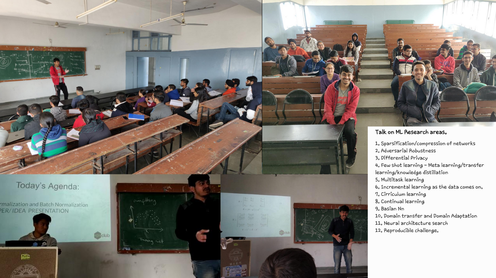

 # AI_Saturdays
## This repository contains the materials of the Sessions conducted on Deep Learning in the year of 2020 by the Programming Club UIET. The name "AI Saturdays" was continued from the previous year's sessions which were held in collaboration with "nurture.ai".
**The session list is as follows**:  
|     | Date            | Speaker                    | Topic                                 | Session Pics                                                                                                      | Link to Post                                                                                                                                                                                             |
|-----|-----------------|----------------------------|---------------------------------------|-------------------------------------------------------------------------------------------------------------------|----------------------------------------------------------------------------------------------------------------------------------------------------------------------------------------------------------|
| 1.  | Jan 25, 2020    | Ankur Bhatia               | Introduction to Deep Learning         | [Intro](https://github.com/ankurbhatia24/AI_Saturdays/tree/master/Intro%20to%20Deep%20Learning)                   | [https://www.facebook.com/pclubuiet/videos/170344660980781/](https://www.facebook.com/pclubuiet/videos/170344660980781/)                                                                                 |
| 2.  | Feb 1, 2020     | Ankur Bhatia               | Optimizing Deep Neral Networks        |                                                                                                                   | [https://www.linkedin.com/posts/bhatia-ankur24_deeplearning-ai-ml-activity-6629438690970165248-fUud](https://www.linkedin.com/posts/bhatia-ankur24_deeplearning-ai-ml-activity-6629438690970165248-fUud) |
| 3.  | Feb 8, 2020     | Sarthak Thakur             | Regularization and Initializations    |                                                                                                                   |                                                                                                                                                                                                          |
| 4.  | Feb 8, 2020     | [Divyam Madaan](https://twitter.com/divyam3897) - Kaist University, South Korea           | SOTA Research and How to do Research? | [SOTA Divyam Madaan](https://github.com/ankurbhatia24/AI_Saturdays/tree/master/SOTA%20Research%20Divyam%20Madaan) | [https://twitter.com/bhatia_ankur24/status/1228171211336609794](https://twitter.com/bhatia_ankur24/status/1228171211336609794)                                                                           |
| 5.  | Feb 14, 2020    | Yeshi Jinsel  Ankur Bhatia | Introduction to Convolutional NN's    | [CNN's](https://github.com/ankurbhatia24/AI_Saturdays/tree/master/Convolutional%20Neural%20Networks)              |                                                                                                                                                                                                          |
| 6.  | Feb 16, 2020    | Ankur Bhatia               | Optimizing Neural Networks            | [Optimizing DNN's](https://github.com/ankurbhatia24/AI_Saturdays/tree/master/Optimizing%20DNN)                    |                                                                                                                                                                                                          |
| 7.  | Feb 22, 2020    |                            | Paper Presentations                   | [Paper Presentations](https://github.com/ankurbhatia24/AI_Saturdays/tree/master/Paper%20Presentation)             | [https://www.linkedin.com/posts/bhatia-ankur24_keras-python-paper-activity-6637716469826326528-2XoI](https://www.linkedin.com/posts/bhatia-ankur24_keras-python-paper-activity-6637716469826326528-2XoI) |
| 8.  | March 5, 2020   | Ankur Bhatia               | Object Detection                      | [Object Detection](https://github.com/ankurbhatia24/AI_Saturdays/tree/master/Object%20detection)                  |  
| 9.  | July 19, 2020   | [Yaxin Li](https://www.linkedin.com/in/i-am-bot/) - Micigan State University, USA        | Building Robust Models                      | [Building Robust Models](https://github.com/ankurbhatia24/AI_Saturdays/tree/master/RobustDL)                  |  [https://www.linkedin.com/posts/bhatia-ankur24_deeplearning-attacks-robust-activity-6690596982945325056-Jt4I](https://www.linkedin.com/posts/bhatia-ankur24_deeplearning-attacks-robust-activity-6690596982945325056-Jt4I)                       |
| 10.  | March 5, 2020   | [Sahib](https://twitter.com/sahib_me) - Carnegie Mellon University, USA         | Careers in Machine Learning                      | [Careers in ML](https://github.com/ankurbhatia24/AI_Saturdays/tree/master/CareersInML)                  |  [https://www.linkedin.com/posts/bhatia-ankur24_aisaturdays-deeplearning-machinelearning-activity-6720672881157709824-Y1dY](https://www.linkedin.com/posts/bhatia-ankur24_aisaturdays-deeplearning-machinelearning-activity-6720672881157709824-Y1dY)                   |
- SLIDES: [PClubAICS2020](https://github.com/ankurbhatia24/AI_Saturdays/blob/master/slides/PClubAICS2020.pdf)  
  
